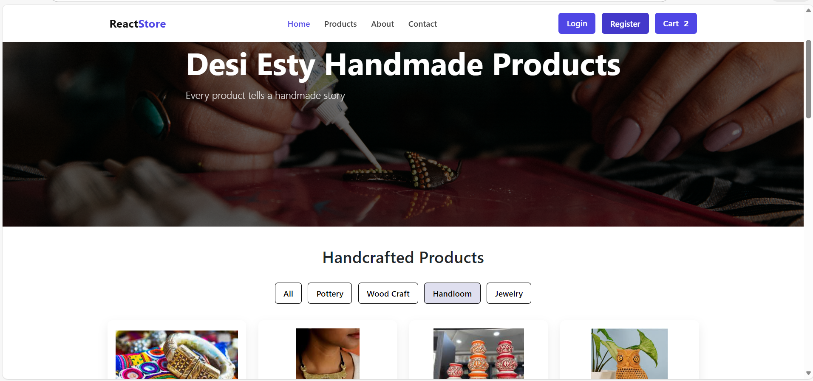

# Handcrafted Items E-Commerce Platform

Full-stack e-commerce web application for selling handcrafted products with cart and order management functionality.

## Tech Stack
React.js, Flask (Python), SQLite, JavaScript, HTML, CSS

## Features
- Product listing for handcrafted items  
- Add to cart and checkout system  
- Order placement with address and total price  
- Backend APIs for order processing and data storage  
- SQLite database integration for storing orders and product details  

## System Flow
React frontend communicates with Flask backend using REST APIs.  
Backend processes requests and stores order data in SQLite database.

## Application Preview

